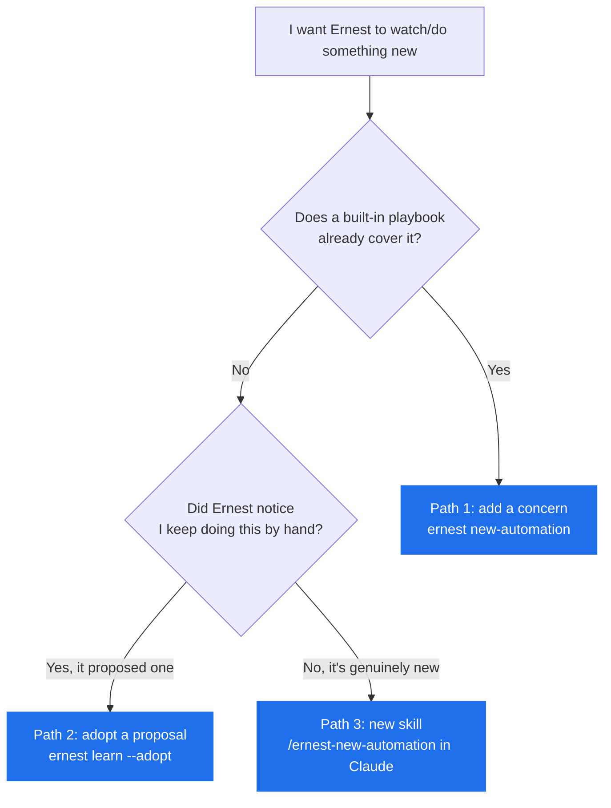

# Add or Scale Automations

Ernest learns new jobs three ways. Start with the smallest that fits — most new behavior is a setting change, not new code.

You never have to run these commands yourself. Just tell Ernest in plain language ("watch our enterprise accounts and ping me if anything goes quiet for a week") and it runs the right command for you. The commands below are written out so a teammate setting Ernest up can run them by hand, and so you can see exactly what's happening under the hood.

Two words to know:
- **Playbook** — a built-in detection recipe (e.g. "find threads that went quiet"). Ernest ships seven.
- **Concern** — one saved instance of a playbook with your settings (e.g. "use the quiet-thread playbook on our VIP accounts, 7-day threshold"). Adding a concern is how you turn on a new watch.

Prompt examples for talking to Ernest: [examples.md](examples.md).



## Path 1 — configure an existing playbook (the common case)

Most new behavior is a **concern**: pick a playbook, point it at your data, set a threshold. No new code.

```bash
# Sync a regional contact list against the CRM, flag anything missing for 7+ days
ernest new-automation --id regional-crm-sync \
  --playbook list-sync --staleness 7d
```

```bash
# Make sure a teammate is on every B2B deal thread
ernest new-automation --id b2b-deal-lead \
  --playbook add-collaborator
```

```bash
# Recover dropped follow-ups, but only for your VIP/Tier-1 accounts
ernest new-automation --id vip-recovery \
  --playbook account-followup-recovery --staleness 7d
```

(For VIP-only, Ernest also writes a `priority_tiers` parameter into the concern; it then watches only accounts marked at those tiers in your CRM/contacts. Tell Ernest the tiers you care about.)

The seven playbooks:

| Playbook | Use it for |
|---|---|
| `account-followup-recovery` | Threads that went quiet; scope to VIPs with `priority_tiers` |
| `inbox-prospect-followup` | Inbound leads needing a first follow-up, by intent |
| `add-collaborator` | A teammate is missing from a category of threads |
| `candidate-followup` | Hiring candidates in the inbox → assign an owner |
| `list-sync` | Reconcile email contacts against a CRM list or sheet |
| `sourcing-pipeline` | A list of targets to source and contact |
| `task-tracker` | Open or overdue tasks from a tracker |

Common settings (Ernest fills these in from what you say):
- `--staleness 7d` — how long a thread can sit before it counts as dropped.
- `--intent partnership` — narrow `inbox-prospect-followup` to one lead type.
- `--window 90d` — how far back to look.

The new concern is live on the next watch run. Ernest watches on its own schedule (weekday mornings and twice midday); to pick it up right now, run `ernest watch` (or `ernest start`, which also watches).

## Path 2 — adopt something Ernest noticed (propose → approve)

Ernest watches for work you repeat by hand and saves it as a **proposal**. Proposals never act on their own — they wait for your approval (level L2).

```bash
ernest learn                              # list current proposals
ernest learn --adopt 1 --id my-check \
  --playbook account-followup-recovery --staleness 7d
ernest watch                              # put the new concern to work now
```

Nothing changes until you `--adopt` a proposal (or approve one in Claude). Until then it's a suggestion, not a behavior.

## Path 3 — a brand-new skill (when no playbook fits)

Run `/ernest-new-automation` in Claude. Ernest interviews you on five things — what starts it, what it should read, what it should produce, what must never happen, and whether it runs on a schedule or on demand — then hands back a reviewable proposal: the new skill, any schedule/concern changes, the tools it needs, its approval level, a dry-run plan (a no-side-effects test pass), and a rollback path. Nothing is installed silently, and it will never add unvetted connectors or credentials on its own.

## Connectors: offline vs. live data

Every automation runs with no live connections at all, reading exported files under `data/`. Connect a tool only when you want live data. Ernest uses native MCP connectors or file exports — **no Composio**. Full setup: [connectors.md](connectors.md).

| Need | Works offline from | Live option |
|---|---|---|
| Mail | `data/mail/` | Gmail / Outlook MCP |
| CRM | `data/hubspot/` | HubSpot MCP |
| Sheet / list | `data/lists/*.csv` | Google Sheets MCP |
| Slack tasks | `data/slack/tasks.csv` | Slack MCP |
| New sourcing | hand-built CSV | Search MCP |

## Governance — what Ernest may and may not do

Ernest **may** propose concerns, schedules, and skills, and turn them on once you approve.

Ernest may **not**, on its own: send or post anything, change credentials, add a new connector, or take on legal or money authority. Those stay manual.

Rolling an automation back:
1. **Turn one off** (fastest, reversible): `ernest disable-concern <id>` — it stops producing reminders. Re-enable with `ernest enable-concern <id>`.
2. **Undo a code/skill change**: revert with git, or restore a prior version with `./install.sh --refresh` (this keeps your memory and config).
