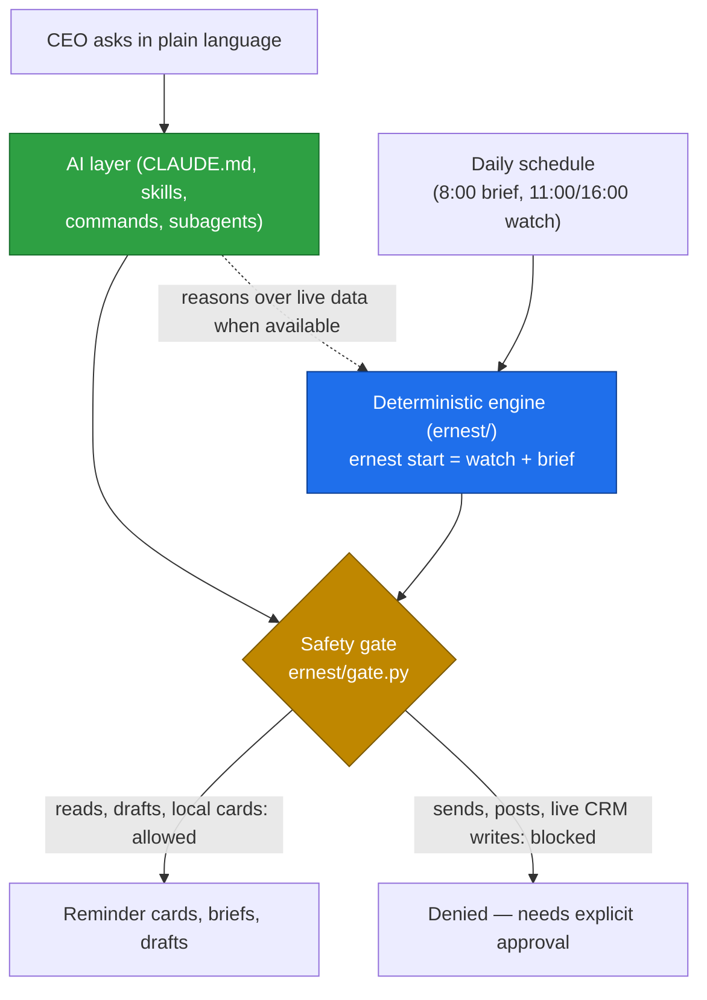

# Architecture

Ernest is one system you reach through several front doors. Underneath, it has a small deterministic engine you can run with no AI and no internet, and an AI layer that makes it conversational. A safety gate sits in front of both and blocks anything that would touch the outside world without your approval.

## The three front doors (surfaces)

| Surface | What it's for |
|---|---|
| **Claude Code** (terminal) | The reliable setup and admin surface. Best for installing, repairing, and "for someone else" setups. |
| **Cowork** (desktop app) | The CEO-friendly surface once everything is verified. No terminal. |
| **Telegram / Slack** (optional) | A chat mirror of your reminder cards, only when the VPS brain is configured. Not the primary surface. |

All three talk to the same engine, memory, and safety gate. Switching surfaces does not change what Ernest can or can't do.

## Two layers



**Engine** — `ernest/`, a pure Python package using only the standard library (no installs, no internet, no AI required). It produces the daily output deterministically, so the system still works when the model or your connectors are down. The CEO's one command is:

```bash
ernest start      # watch for what slipped + write the morning brief
```

Everything else is optional: `ernest read`, `ernest grade`, `ernest draft`, `ernest audit`, `ernest new-automation`, `ernest learn`, `ernest render`, `ernest doctor`. Prompt examples that map plain English to these: [examples.md](examples.md).

**AI layer** — `CLAUDE.md` (Ernest's identity and hard rules), plus *skills* (reusable playbooks like `morning-brief` or `b2b-lead-grading`), *commands* (slash shortcuts like `/ernest-setup`), and *subagents* (focused helpers in `agents/`). This is the natural-language interface. When live connectors or the VPS brain are available it reasons over real data; otherwise it falls back to the engine's deterministic output. You never have to remember a command — you describe what you want and the AI layer translates it into engine actions.

Both layers are guarded by the same gate logic in **`ernest/gate.py`** (see Safety below).

## Where the truth lives (sources of truth)

| Thing | Where it lives |
|---|---|
| Canonical memory + connector tokens | **VPS Ernest brain** — only when you've configured it |
| Skill library + plugin behavior | **git-versioned `ernest-cc`** repo |
| Local memory, briefs, drafts, exports | **`~/ErnestVault`** (output) and **`data/**`** (inputs) on your machine |

In the default **local mode** nothing leaves your machine. The **VPS brain mode** is opt-in: it moves memory and the heavy connectors to your own server so tokens never sit on the laptop. The mode is selected by the `ERNEST_MODE` environment variable (`local` by default).

## How a run flows

1. Claude Code or Cowork loads `CLAUDE.md`, the skills, commands, the three hooks, and your MCP connector config.
2. A schedule (or you typing `ernest start`) runs the engine; the AI layer invokes skills whenever you ask for something.
3. Work pulls from the best available source, in order: **VPS brain → native MCP connectors → exported files in `data/**`**. No Composio. ([connectors.md](connectors.md))
4. The gate inspects every action first. Reads, local reminder cards, and draft *creation* pass; sends, posts, and live CRM writes are blocked. Drafts are written to disk, never sent.
5. Outputs land as **reminder cards** (`~/ErnestVault/Ernest/00-Watch/`), **briefs** (`.../00-Daily/`), and **drafts** (`.../00-Drafts/`). Cached thread bodies go to `.../00-Threads/`.
6. When a session ends, the Stop hook records improvement candidates to `logs/learning-proposals.jsonl`.
7. `ernest learn` / `/ernest-learn` turns those candidates into reviewed, approval-gated proposals before anything changes.

## Safety: the gate and the three hooks

"Hooks" are scripts Claude Code runs automatically at fixed moments. Ernest registers three (in `hooks/hooks.json`), and they are the spine of its safety model:

| When it runs | Script | What it does |
|---|---|---|
| **Before every tool call** (PreToolUse) | `hooks/pre_tool_use.py` | Runs the gate. **Fails closed**: if it can't parse the request or the gate errors, it denies rather than allowing. |
| **At session start** (SessionStart) | `hooks/session_context.py` | Injects `CLAUDE.md` (Ernest's persona + hard rules) when installed as a plugin, since plugins don't auto-load it. |
| **When a session ends** (Stop) | `hooks/capture_learnings.py` | Records self-improvement candidates for later review. Never edits skills, configs, or credentials. |

The PreToolUse hook is a thin adapter; the real logic lives in **`ernest/gate.py`** and is **deny-by-default for external effects**. It blocks more than just sends:

- **External mutations** — sends, posts, calendar invites, live CRM/contract writes (only true draft *creation* passes).
- **Risky filesystem writes** — writes outside Ernest's own scope, plus reads of secret files.
- **Network escapes** — shell network commands (`curl`, `wget`, `ssh`, ...) and, in confidential/local mode, the built-in web tools.
- **Laundering attempts** — Composio-style execution wrappers are unwrapped and judged by the *real* inner action, so a generically named server can't sneak a send through.

Every decision is appended to `logs/enforcement-audit.log`. Full details: [security.md](security.md).

## Why it's built on native Claude Code

Ernest uses Claude Code's built-in machinery directly instead of a custom wrapper. That gives it, for free: skills, hooks, subagents, MCP connectors, slash commands, one-click plugin distribution, headless runs (`claude -p`, i.e. running Claude from a script with no chat window), and a clean path to Cowork. The payoff is less custom code to maintain and behavior that stays consistent across every surface above.
