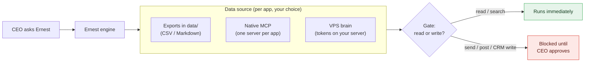

# Connectors (no Composio)

Ernest does **not** use Composio or any generic action router. A connector here is one standard MCP server per app that you choose and approve — or an exported file under `data/` when you want zero third parties touching your data.

Whatever the source, the same safety rule holds: **Ernest reads and searches freely; it never sends, posts, or writes to a live system until you approve the exact action.** That rule is enforced in code, not by convention (`ernest/gate.py`).

## What works with no connector at all

```bash
./install.sh    # once
ernest start    # every day
```

The engine reads exported mail, CRM lists, sheets, sourcing targets, and Slack tasks straight from `data/`. No model, no OAuth, no middleman. This is the default, and it's enough to run the watch + remind + assign automations end to end.

## Three ways to get data in

| Approach | Trust model | Setup |
|---|---|---|
| **Exports** | Highest — you control the files | Drop CSV/Markdown exports into `data/` |
| **Native MCP** | Direct — one server per app | Operator adds it at install, or `claude mcp add` |
| **VPS brain** (optional) | Tokens live on your server, not your laptop | `./install.sh --mode vps` |

Pick one per app — and mixing is fine. Live Gmail MCP alongside an exported HubSpot list is a normal setup.



## Native MCP (recommended when going live)

Each connector is a normal MCP server with named tools — not a catch-all execute endpoint. The pattern is always the same: **search finds candidates, read loads the full conversation, draft prepares a reply, send waits for you.**

```text
mcp__gmail__search_threads      find candidate threads
mcp__gmail__get_thread          read the full email thread (do this after search)
mcp__gmail__create_draft        prepare a draft (allowed — nothing leaves)
mcp__gmail__send_email          BLOCKED by the gate until the CEO approves
mcp__slack__get_thread          read a full Slack thread / its replies
```

The same shape applies to HubSpot, Slack, Google Sheets, Calendar, Teams, and the rest.

**How the gate decides (no config to memorize):**

- Tools whose action reads (`search`, `get`, `list`, `read`, `fetch`, ...) run immediately.
- Tools whose action mutates (`send`, `post`, `update`, `delete`, `create`, ...) are held for approval.
- On a sensitive connector (mail, CRM, Slack, calendar, payments, ...), an *unrecognized* action is denied by default rather than guessed.
- Composio-style "execute this tool" wrappers and any remote shell/code execution are blocked outright — the gate looks inside the wrapper at the real action.

**How to add one:**

1. Choose a server you trust — official, self-hosted, or a built-in OAuth connector where one exists.
2. The operator adds it to the MCP config during install. The CEO never edits JSON.
3. Ernest uses it read-first; writes and sends stay approval-gated.

See `examples/local-only.mcp.example.json` for the shape. The installer writes the live config to `~/.ernest-cc/.mcp.json` and locks it to owner-only. To connect Gmail/HubSpot/Slack interactively, open Claude Code in `~/.ernest-cc` and run `/ernest-onboard` (see `docs/quickstart.md`).

## Per use-case

Offline paths below are where an export *goes*. Folders that ship with sample data already exist (`data/mail/`, `data/slack/`, `data/hubspot/`, `data/lists/`, `data/sourcing/`); the rest you create when you drop the first export in.

| Automation | Offline (`data/`) | Live (native MCP) |
|---|---|---|
| Dropped follow-ups | `data/mail/` (full threads) | Gmail MCP: search + **get_thread** |
| Slack owed replies | `data/slack/threads/` | Slack MCP: search + **get_thread** |
| Important contacts (tier) | `data/mail/` + `data/hubspot/` | Mail + HubSpot MCP |
| Add collaborator to threads | mail with `participants` | Mail MCP |
| Candidate follow-up | mail with `category: candidate` | Mail MCP |
| List sync (CRM / sheet) | `data/lists/*.csv` | HubSpot or Sheets MCP |
| Sourcing pipeline | `data/sourcing/targets.csv` | A web-search MCP (optional) |
| Slack task tracking | `data/slack/tasks.csv` | Slack MCP (read channels) |
| Call prep | `data/hubspot/` + your call notes | HubSpot + Fireflies + Clay/Apollo + web |
| Call coaching | your call notes | Fireflies (or Gong) + HubSpot + Notion |
| Support triage | your exported tickets | Pylon + Zendesk + Intercom (Fin) + Slack |
| Hiring pipeline | your exported candidates | Ashby + Calendar + Gmail/Slack + Notion |
| Lead enrichment | your exported leads | Clay + Apollo + HubSpot |
| Deal desk (contracts) | dry run only | HubSpot + Ironclad (via MATIC) + Notion |

## Northwind stack map (flexible / swappable)

Connectors are a swappable layer — point a skill at whatever tool you actually use. This maps the current Northwind stack and the open gaps. Reads and searches run freely; **sends, posts, and CRM/contract writes stay approval-gated.**

| Function | Tool (Northwind) | Ernest use | Status |
|---|---|---|---|
| CRM / source of truth | HubSpot | canonical contacts, deals, stages | live-capable |
| Lead routing | HubSpot automations | watch + assign | live-capable |
| Enrichment | Clay + Apollo | `lead-enrichment` → grading | live-capable |
| Call recording | Fireflies | `call-prep`, `call-coaching` | live-capable |
| Coaching | — (gap) | `call-coaching` builds the layer | new |
| Contracts (CLM) | Ironclad (+ MATIC) | `deal-desk` pilot, L3-gated | pilot |
| Comms | Slack | routing, owed replies, approvals | live-capable |
| Support self-serve | Intercom Fin (testing) | `support-triage` deflection | evaluating |
| Tickets | Pylon + Zendesk | `support-triage` | live-capable |
| Knowledge / policy | Notion | positioning, policy, playbooks | live-capable |
| Data warehouse | Hex | metrics on request | optional |
| ATS | Ashby | `hiring-pipeline` | live-capable (no autos yet) |
| Productivity | Google Workspace | Calendar/Gmail in brief + prep | live-capable |
| Orchestration | Claude (connectors) | all of the above | this system |

Open gaps Ernest is built to help close: (1) self-serve routing (Fin pilot), (2) contracts inside the CRM (HubSpot → Ironclad via MATIC — needs legal sign-off), (3) coaching / best-practice capture, (4) hiring automation. Each has a skill that works read-first today and proposes the write or automation step for approval.

## VPS brain (optional)

If you run a VPS, the connectors can live there instead of on the CEO's laptop. Local Claude Code then talks to a single remote MCP, `ernest-brain`, and app tokens never touch the laptop. See [vps-brain.md](vps-brain.md).

Composio is **not** part of this stack. The old Hermes-based Ernest used it; **ernest-cc** deliberately does not.
