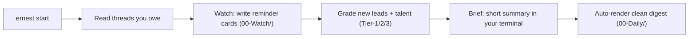

# Daily Use

## One command

```bash
ernest start
```

Watch + brief. Reminder cards land in `~/ErnestVault/Ernest/00-Watch/`, and a clean
**digest** (the "Read more" view) in `~/ErnestVault/Ernest/00-Daily/digest--<date>.html`.
Nothing sends.

Prompts for Claude: [examples.md](examples.md).

### What `ernest start` actually does



Every step is read-only. Ernest never sends, posts, or writes to a live system — it
only tells you what needs you. Drafting happens only when you ask (see below).

## Readable, adaptive answers

In Claude, answers are **short by default** — Bottom line, a few action bullets,
then a **Read more →** link to the digest. Tell Ernest what you like and it
remembers (in `memory/preferences.md`): "too long, 4 bullets", "prefer PDF",
"hide trash tier", "always show $ amounts". You rarely need commands — just talk to it.

The machine-read settings behind this live near the bottom of `memory/preferences.md`:

```
auto_render: on
read_more_format: html      # set to "pdf" to get a PDF digest
max_key_points: 6           # max action bullets per answer
```

## What runs automatically

Each `start` evaluates every enabled concern in `memory/standing-concerns.md`:

| Type | Watch concern | Example card |
|---|---|---|
| Follow-ups | `dropped-followups` | Threads you owe a reply on |
| VIP recovery | `important-followups` | Investor/VIP-tier slips |
| Inbound prospects | `inbox-prospects` | Partnership/sales leads waiting |
| Collaborator coverage | `b2b-collaborator-coverage` | Threads missing a teammate |
| Candidate routing | `b2b-candidates` | Inbox hires to route to recruiting |
| List sync | `korea-list-sync`, `press-list-sync` | Email vs CRM or sheet gaps |
| Sourcing | `partnership-sourcing` | Pipeline targets to contact |
| Task tracking | `slack-task-tracking` | Open/overdue Slack tasks by owner |
| Open Slack threads | `slack-open-threads` | Slack conversations gone quiet |

All are remind-only unless you ask for drafts. (`open-promises` and `mail-audit` ship
disabled — the deep mail audit is on-demand via `ernest audit`, too heavy for daily watch.)

Don't edit the YAML by hand — tell Ernest, or use `/ernest-new-automation`.

## Claude vs terminal

| Task | In Claude | Terminal |
|---|---|---|
| Daily | "What needs me today?" / `/ernest-brief` | `ernest start` |
| Clean / shareable view | "show today's digest" | `ernest render --open` (`--pdf`) |
| Tune answers | "too long, prefer PDF" | `ernest feedback "..."` / `ernest prefs` |
| Draft (optional) | `draft these` / `/ernest-draft` | `ernest draft --concern <id>` |
| New automation | `/ernest-new-automation` | `ernest new-automation --id ... --playbook ...` |
| Learning | `/ernest-learn` | `ernest learn` |
| Health check | `/ernest-doctor` | `ernest doctor` |

Use Claude when you want live mail/CRM/Slack search. Use `ernest start` when exports
or sample data are enough — it needs no model, no connectors, no sign-in.

Common terminal commands, copy-paste-ready:

```bash
ernest start                       # the daily one: watch + brief + digest
ernest render --open --pdf         # open today's digest and also save a PDF
ernest feedback "answers too long" # teach Ernest your taste
ernest doctor                      # health + config snapshot
```

## First-time setup

Run **`/ernest-setup`** in Claude (or `ernest onboard` in the terminal). Ernest asks
about five plain questions — your name and company, your ideal customer, your red lines,
which tools to watch — and configures itself. Local-first, nothing sent. Re-running it
never overwrites what you've already set.

## Scheduling

Run **`ernest schedule`** once. Ernest then prepares your weekday morning brief at 08:00
and checks for updates at 07:30 — no open Claude session required, nothing sent.

```bash
ernest schedule           # set it up
ernest schedule --remove  # turn it off anytime
```

Under the hood it installs a launchd agent on macOS. On Linux or other systems, use the
bundled cron file instead:

```bash
crontab ~/.ernest-cc/crontab.example
```

The cron version schedules a bit more than the macOS agent: the weekday 08:00 brief, an
ambient watch at 11:00 and 16:00, a weekly learning summary on Friday at 17:00, and the
daily 07:30 update check. ("launchd" and "cron" are just the standard schedulers built
into macOS and Linux — you don't need to know more than the two commands above.)

## Connectors

Optional. Native MCP or file exports — not Composio. "MCP" is just the standard way
Claude plugs into a tool like Gmail or HubSpot; until you connect one, Ernest runs on
exports under `data/`. Details: [connectors.md](connectors.md).
