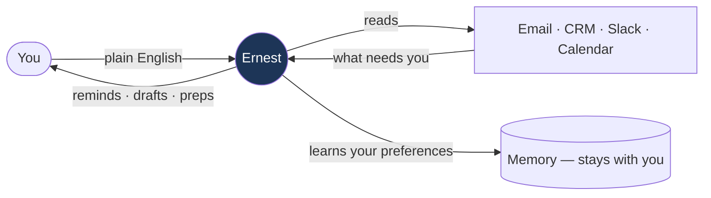
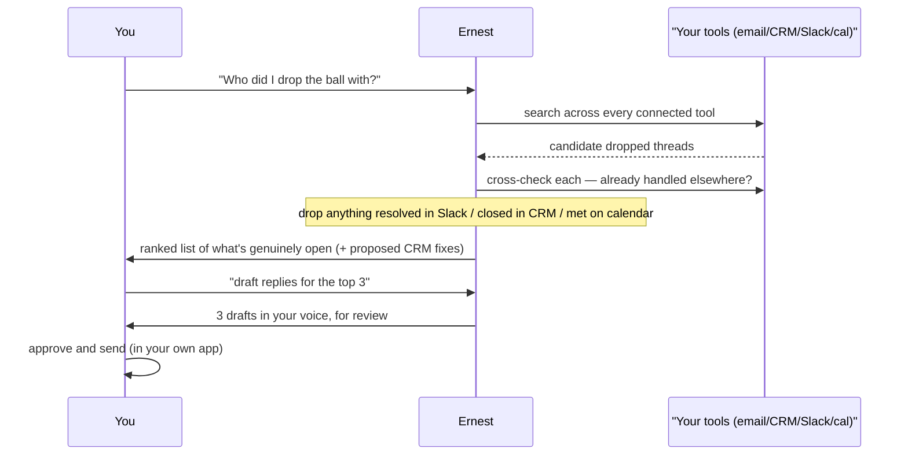
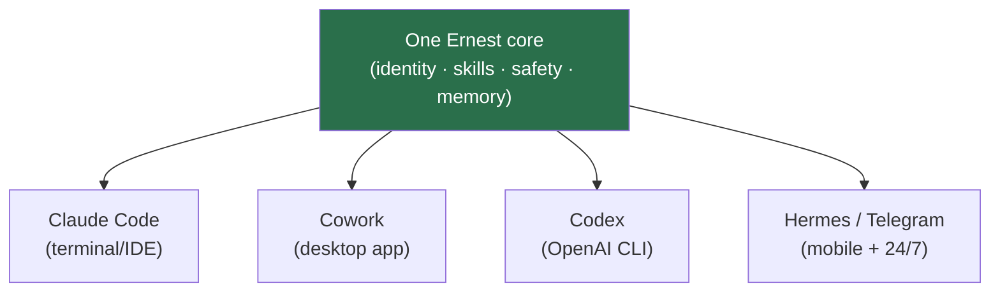
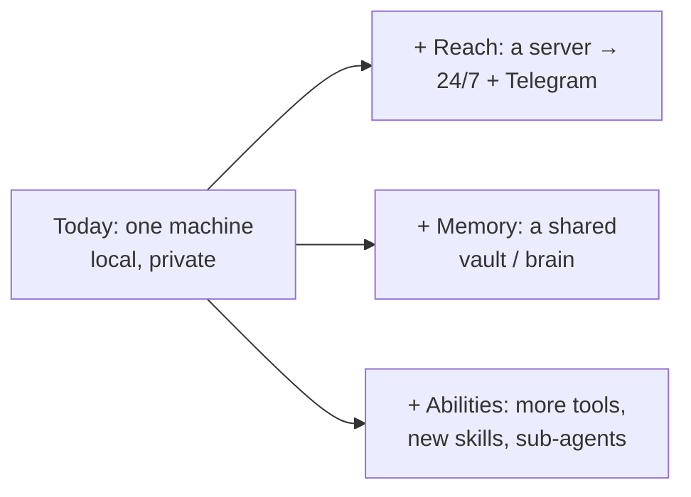
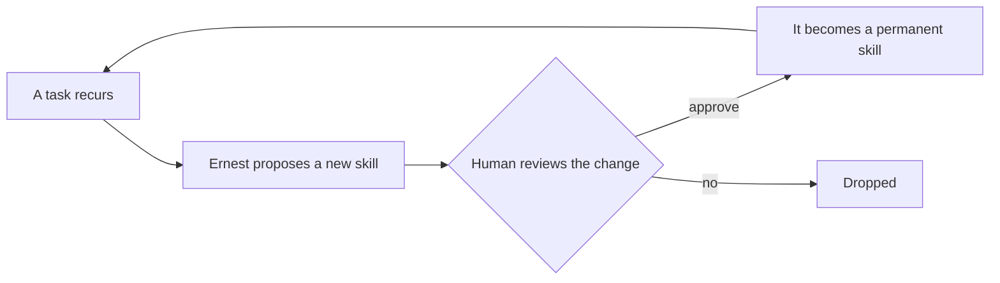
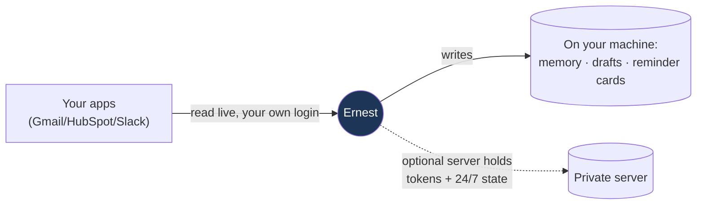

# Ernest — how it works

A plain explanation of what Ernest is, how it operates, where it runs, and how it
stays safe. No prior knowledge of automations, MCP, Hermes, or Claude assumed.

---

## What Ernest is

Ernest is a draft-first **chief of staff**. It watches the tools a busy founder
already lives in — email, CRM, Slack, calendar — surfaces what genuinely needs them,
and prepares replies and outreach on request. It does not send, post, or change any
external system on its own. By default everything stays on the user's machine.

It is not a chatbot you have to drive turn by turn, and not a rules-based automation
that fires blindly. It reads, reasons, and *prepares* work for a human to approve.

---

## How it works: three verbs

Everything Ernest does is one of three things:

1. **Watch** — on a schedule, or when asked ("what needs me?"). It scans connected
   tools and surfaces open loops: dropped follow-ups, quiet deals, threads you owe,
   promises you made. This is remind-only; it never acts here.
2. **Draft** — only when asked ("draft these", "reply to Acme"). It writes messages
   in the user's voice, grounded in the real thread, and shows them for review.
3. **Send** — always the human. Ernest hands over a finished draft; a person sends it.

The third line is the core property: **Ernest cannot send, post, or change a system
on its own.** The Safety model section below explains how that is enforced in code,
not just stated as policy.

---

## The request lifecycle

What happens on a request like *"Who did I drop the ball with?"*:

The notable part is the cross-check: a thread that looks unanswered in email may
already be resolved in Slack or closed in the CRM. Ernest checks the other tools
before flagging something, so it surfaces genuinely-open items rather than noise.

---

## Where it runs

The same Ernest runs on four surfaces. Each has its own quick-start guide.

- **[Claude Code](claude-code.md)** — terminal/IDE; the full safety gate and live tools.
- **[Cowork](cowork.md)** — the desktop app; no terminal, just chat.
- **[Codex](codex.md)** — the OpenAI CLI; local read-and-draft (softer safety — see its guide).
- **[Hermes](hermes.md)** — a Telegram bot on a small server; the only mobile, 24/7 surface.

They share the same core. A laptop surface can also connect to the server's brain
(`/ernest-connect-brain`) to share one memory, reminder set, and draft store —
see [plus-vps.md](plus-vps.md).

---

## Safety model

Ernest's safety is a piece of plain code — the **gate** — that runs before every
action and denies by default. It is not the model promising to behave.

In practice:

- Sends and live CRM writes are blocked in code and become drafts — regardless of
  what the model is asked to do, including by a malicious email.
- Data stays on the user's machine by default; there is no Ernest cloud.
- The safety code is protected from Ernest itself, so it cannot weaken its own rules.

The strongest enforcement (a deterministic PreToolUse hook) runs on **Claude Code**
and **Cowork**. **Codex** uses softer layers (a strict `AGENTS.md` + the CLI's own
sandbox/approval), so live sending is left to Claude Code or Hermes. **Hermes** runs
its own server-side gate and a brain contract that exposes no send tool at all.

---

## How it scales

Ernest starts as a single local assistant and grows along three independent axes —
**reach**, **memory**, and **abilities** — as far as needed. None of these is a
one-way door; posture changes with a setting, not a migration.

---

## How it improves over time

New abilities are added the same way: noticed, proposed, reviewed, adopted.

Ernest can extend what it *does*, but never expands its own *authority* — it cannot
grant itself the right to send, spend, or touch credentials. Every new skill is a
reviewable change with an undo.

---

## Where data lives

- **Live data** (emails, deals, messages) is read through the user's own accounts —
  the same access they already have.
- **What Ernest learns** (company facts, preferences, drafts, reminders) is plain-text
  files on the machine — readable, diff-able, and backed up like any folder.
- **The optional server** is the only place that holds connector tokens, and it is
  isolated; the laptop never copies them.

---

## Common questions

- **How does it connect to Gmail/HubSpot/Slack?** Through standard connectors the
  user authorizes once. On the server that's Composio; on Claude Code/Cowork it's
  native MCP. The user grants access like any app; no password is ever seen.
- **How does it avoid sending the wrong thing?** It can't send at all — everything is
  a draft until a human approves it.
- **How does it write in the user's voice?** It reads the real thread and, over time,
  the user's own sent mail, and drafts to match. Without samples, drafts stay neutral.
- **What if it's unsure?** It flags low-confidence calls instead of guessing, and
  shows the source for each claim. The human is always the approver.
- **Is the data private?** Local by default — nothing leaves the machine. A server is
  opt-in and isolated.
- **Does it work offline?** Yes — it ships with sample data so the first run is real,
  and the core engine needs no internet.
- **How is a new use-case added?** Ask in plain English ("every Friday, flag investor
  follow-ups"). Ernest scaffolds a reviewable skill — no coding.
- **How is this different from n8n/Zapier?** Those fire fixed rules. Ernest reads,
  reasons, cross-checks, and drafts — and asks before acting.

---

## Where it stands today

- Four surfaces work: Claude Code, Cowork, Codex (read-and-draft), and Hermes/Telegram
  (mobile + 24/7).
- A laptop surface and the server can share one **memory, reminder set, and draft
  store** via the brain (`/ernest-connect-brain`).
- Sharing live **account reads** through the server is the next wiring step; today
  live tools are connected per surface.
