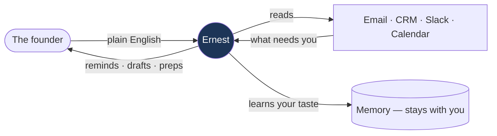
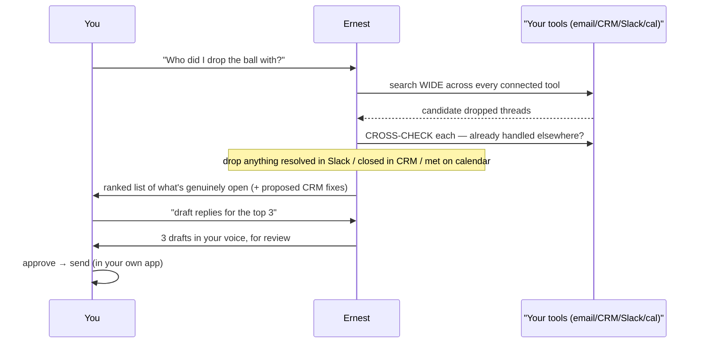
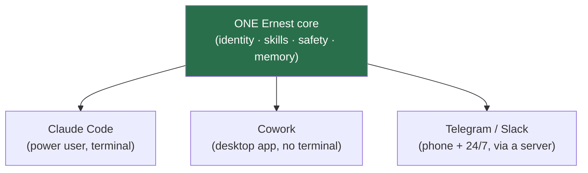
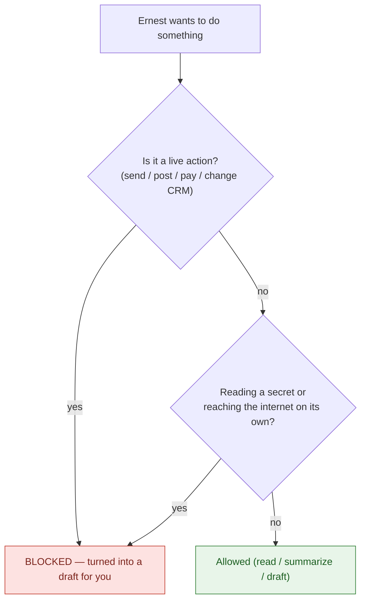
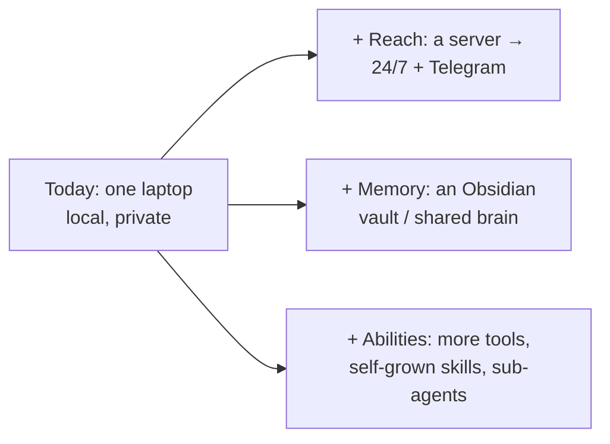
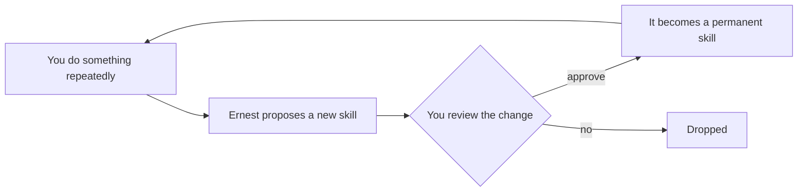
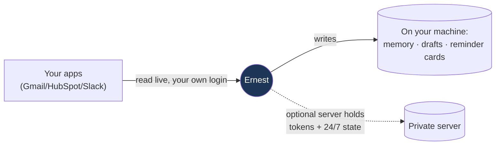

# Ernest — the teammate guidebook

For anyone who needs to **demo Ernest, sell it, and answer questions** — even if you've
never touched automations, n8n, Hermes, or Claude. Read this once and you'll be able to
run the demo and field the "but how does it…?" questions with confidence. No jargon.

---

## 1. What Ernest is (say this in one breath)

> Ernest is an AI **chief of staff**. It quietly watches the tools a busy founder already
> lives in — email, CRM, Slack, calendar — tells them what actually needs them, drafts
> the replies and outreach when asked, and **never sends anything without approval.** By
> default everything stays on the person's own machine.

It is **not** a chatbot you have to babysit, and **not** a brittle automation that fires
blindly. It's an assistant that *prepares* the work and hands it to you to approve.

---

## 2. How it works (the mental model)

There are only three verbs. Everything Ernest does is one of them:

1. **Watch** — automatically (or when you ask "what needs me?"). It scans your tools and
   surfaces open loops: dropped follow-ups, quiet deals, threads you owe, promises you
   made. This is **remind-only** — it never acts here.
2. **Draft** — only when you ask ("draft these", "reply to Acme"). It writes the messages,
   in your voice, grounded in the real thread — and shows them to you.
3. **Send** — always **you**. Ernest hands you a finished draft; you press send.

That third line is the whole trust story: **Ernest cannot send, post, or change a system
on its own.** (Section 5 explains how that's *enforced*, not just promised.)

---

## 3. The request lifecycle (what happens when you ask it something)

Say you ask: *"Who did I drop the ball with?"* Here's the full journey:

The non-obvious bit teammates should highlight: **Ernest searches every tool and
cross-checks for resolution before it bothers you.** A thread that looks unanswered in
email may already be resolved in Slack or closed in the CRM — Ernest checks and suppresses
it. That's what makes it feel like a real chief of staff instead of a dumb reminder.

---

## 4. Where it runs (the three surfaces — same brain)

The same Ernest shows up in three places. Pick whichever suits the moment:

- **Claude Code** — for power users at a keyboard.
- **Cowork** — the desktop app; no terminal, just chat.
- **Telegram** (running on a small always-on server) — Ernest on your **phone**, and it
  keeps watching **overnight** while your laptop sleeps. This is the live demo surface.

They share the same DNA. You can also connect a laptop surface to the server's
**shared brain** so they share one *memory, reminder cards, and drafts* — ask
`/ernest-connect-brain` (and `/ernest-go-local` to disconnect). Sharing live
*account reads* through the server is the next wiring step. See
[plus-vps.md](plus-vps.md).

---

## 5. How it's safe (the part that closes deals)

Ernest's safety is **not** the AI promising to behave. It's a piece of plain code — the
**gate** — that runs *before every single action* and blocks first, asks questions later.

Say it plainly to a prospect:
- **It can't send or change anything without you** — that's enforced in code, not a setting.
- **Even a malicious email** that says "send this now" can't make it act — the worst case
  is a draft you review.
- **Your data stays on your machine** by default; no Ernest cloud.
- **It can't even weaken its own rules** — the safety code is locked from itself.

---

## 6. How it scales (the roadmap you can pitch)

Start as a single local assistant; grow it on three independent axes — **reach**, **memory**,
**abilities** — as far as the company wants.

Nothing here is a one-way door — you change posture with a setting, not a migration.

---

## 7. The agent lifecycle (how it gets better over time)

Ernest grows new abilities the more it's used — safely:

Crucial selling point: **it can extend what it *does*, but it can never expand its own
*authority*** — it can't grant itself the right to send, spend, or touch credentials. Every
new skill is a reviewable change with an undo.

---

## 8. The data lifecycle (where everything lives)

- **Live data** (emails, deals, messages) is read through the person's **own accounts** —
  the same access they already have.
- **What Ernest learns** (company facts, preferences, drafts, reminders) is **plain text
  files on their machine** — readable, diff-able, backed up like any folder.
- **Optional server** (for 24/7) is the only thing that holds connector tokens, and it's
  isolated; the laptop never copies them.

---

## 9. Answers to the "how" questions (your cheat sheet)

- **How does it connect to Gmail/HubSpot/Slack?** Through standard connectors you authorize
  once (like granting any app access). On the server it's Composio; locally it's native
  connectors. The person clicks "allow" — we never see their password.
- **How does it not spam people?** It physically can't send. Everything is a draft until the
  human approves. (Demo this — it's the killer point.)
- **How does it write in my voice?** It reads the real thread and, over time, the person's
  own sent mail, and drafts to match. Until it has samples, drafts stay neutral and must be
  reviewed.
- **What if it's wrong?** It flags low-confidence calls instead of guessing, and shows the
  source for every claim. You're always the approver.
- **Where's my data / is it private?** Local by default — nothing leaves the machine. Great
  for NDA-sensitive teams. A server is opt-in.
- **Does it work offline / without connecting anything?** Yes — it ships with sample data so
  the first run is real, not empty, and the core engine needs no internet.
- **How do we add a new use-case?** Ask it in plain English ("every Friday, flag investor
  follow-ups"). It scaffolds a reviewable skill. No coding.
- **n8n / Zapier / Hermes — how is this different?** Those fire blind rules. Ernest *reads,
  reasons, cross-checks, and drafts* — and asks before acting. It's an assistant, not a
  tripwire.

---

## 10. The 3-minute demo script

> Use the **Telegram bot** (@ernest_agibot) — it's live and on your phone. Have one email
> account connected beforehand so there's real data.

**0:00 — The hook (15s).** "This is Ernest. It's an AI chief of staff that watches your
inbox, CRM, and Slack, tells you what needs you, and drafts replies — but it can never send
anything without you. Watch."

**0:15 — Watch (45s).** Type **"What needs me today?"** → it returns a ranked brief. Point
out: "It searched everything and only shows what's genuinely open — it already dropped the
ones that were handled elsewhere."

**1:00 — The safety moment (45s).** Type **"reply to the top one and send it."** It produces
a **draft** and says it won't send without approval. Say: "That's the whole point — it
*can't* send on its own. That's enforced in code, not a promise."

**1:45 — Draft quality (30s).** Show the draft is in their voice, references the real thread.
"You approve, or tweak, then send from your own app."

**2:15 — Range + scale (30s).** "Same Ernest runs on your laptop in Claude and Cowork, and
here on your phone 24/7. Start local and private; add tools and a server as you grow."

**2:45 — Close (15s).** "So: it finds what you dropped across every tool, drafts the fix in
your voice, and never acts without you. That's the pitch."

---

## 11. The four things that make it land (memorize these)

1. **It can't send without you** — enforced in code. (Trust.)
2. **It searches every tool and cross-checks** before bothering you. (Smart, not noisy.)
3. **Your data stays on your machine.** (Privacy / NDA-safe.)
4. **It grows new skills by being asked** — no engineers. (It compounds.)
