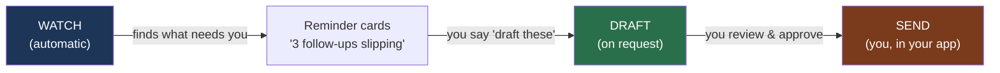
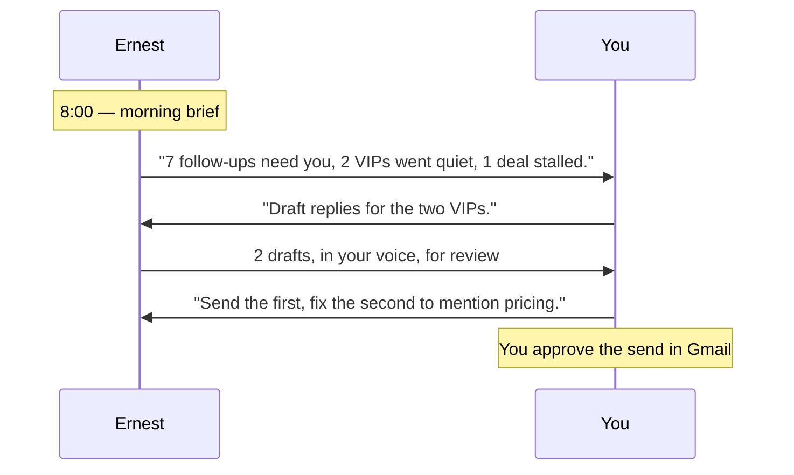
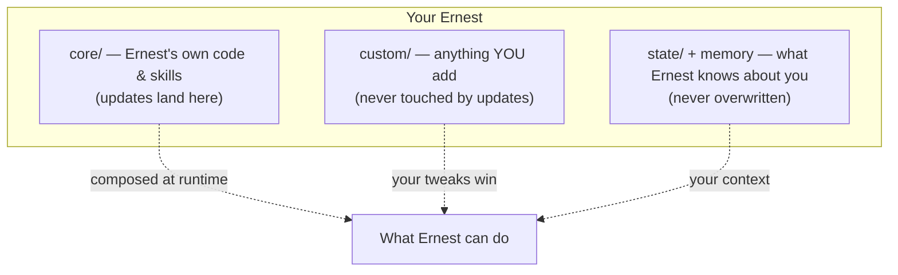

# How Ernest works

A two-minute mental model. No code required.

## The one idea

Ernest **watches** your work and tells you what needs you. It **drafts** replies and
outreach **only when you ask**. It **never sends** anything on its own. You stay in
control of every word that leaves your name.

- **Watch** runs in the background (or when you say "what needs me?"). It only reminds.
- **Draft** happens when you ask ("draft these", "reply to Acme"). Drafts are written
  for your review — nothing is sent.
- **Send** is always you. Ernest hands you a finished draft; you press send.

## A day with Ernest

## What's running under the hood (you never touch this)

Ernest is built in three layers, kept in separate folders so an update can never
wipe your work:

- **core** is Ernest's shipped brain. Updates only replace this.
- **custom** is your own additions (a new use-case, a tweaked reply style). Updates
  never touch it; your versions win over the defaults.
- **state / memory** is everything Ernest learns about you and your company. It stays
  put through every update, and it stays **on your machine** (see [privacy.md](privacy.md)).

## The safety gate (always on)

Every action passes a deterministic safety check *before* it can run — not a polite
request to the AI, an actual gate:

- Live sends, posts, CRM changes, payments → **blocked** until you approve.
- Reading your secrets or phoning out to the internet in private mode → **blocked**.
- Reading, searching, and preparing drafts → **allowed**.

So even if a malicious email tries to trick Ernest into "send this now," the worst it
can do is prepare a draft for you. (Details: [security.md](security.md).)

## Where to go next

- Get set up by talking: run `/ernest-setup` (see [quickstart.md](quickstart.md)).
- Day-to-day prompts: [daily-use.md](daily-use.md) and [examples.md](examples.md).
- Add a new thing for Ernest to watch: [add-automation.md](add-automation.md).
- What stays private: [privacy.md](privacy.md). How updates work: [updates.md](updates.md).
