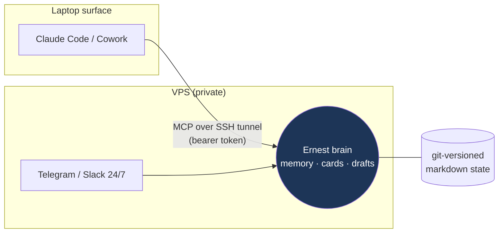

# Running a local surface + the VPS brain (CC+VPS, Cowork+VPS)

By default Claude Code and Cowork run **local-only**: local memory, local
connectors, `data/` exports. That's private and needs no server. The optional
**VPS brain** lets a laptop surface and the 24/7 Telegram/Slack Ernest share **one
state** — the same memory, the same reminder cards, the same draft store — so what
your phone notices overnight is waiting in Claude in the morning, and vice-versa.

This doc is the honest, end-to-end picture of the two `+VPS` combos: what's shared,
how to turn it on/off with no terminal fuss, the security model, and the current
limits.

## What the brain is (and is not)

The brain (`brain/server.py` + `brain/brain_core.py`) is a tiny stdlib JSON-RPC
HTTP server exposing a **fixed contract** of tools over the same markdown memory +
vault the local engine uses:

- `search_memory` / `write_memory` — canonical memory.
- `list_watch_cards` / `write_watch_card` — shared reminder cards (idempotent by
  key, so both surfaces converge instead of duplicating).
- `create_mail_draft` — draft creation only.
- `search_mail` / `read_mail_thread` / `search_hubspot` / `search_slack` /
  `read_slack_thread` — connector reads.

It is **draft-first by construction**: the contract exposes **no** send/post/
publish tool, and every connector/draft call is additionally routed through the
same deterministic core gate the laptop uses. So the VPS enforces identically to
the laptop — a mis-added mutating tool would be blocked in both places.



## Turn it on / off (no terminal fiddling)

In Claude, just ask — or run the commands:

| You want | Command | What happens |
|---|---|---|
| Share state with the VPS | `/ernest-connect-brain --url <brain-url>` | persists `mode: vps`, registers the `ernest-brain` MCP server, probes health |
| Go back to local-only | `/ernest-go-local` | persists `mode: local`, removes the connector; brain on the VPS is untouched |

Both are **idempotent** and **secret-safe**: the bearer token is stored only as the
placeholder `${ERNEST_BRAIN_TOKEN}` (Claude expands it from the environment), so
`connection.json` / `.mcp.json` never hold a secret. Mode is persisted in
`connection.json`, so it survives across sessions without an `ERNEST_MODE` env var.

- **Claude Code** runs `claude mcp add/remove` for you (local scope).
- **Cowork** has no CLI — after the command persists state, add the connector once
  via **Settings → Connectors → Add custom (HTTP/MCP)** (URL + `Authorization:
  Bearer <token>`). `/ernest-connect-brain` prints these exact steps.

## Deploy the brain on the VPS

Not running yet by default. Deploy it (with the CEO's go-ahead) from the repo root:

```bash
./adapters/vps/deploy-brain.sh        # interactive; --yes to skip the prompt
```

It bundles the engine + brain (stdlib only — no pip on the VPS), backs up any prior
install, writes a `0600` env file holding the tokens, installs a `systemd` unit
(`ernest-brain`) bound to **127.0.0.1**, starts it, and health-checks it. It then
prints the SSH-tunnel + `/ernest-connect-brain` steps for the laptop.

## Security model

- **Never exposed to the internet.** The brain binds loopback on the VPS; the
  laptop reaches it through an SSH tunnel. The server also **fails closed** — it
  refuses to bind a non-loopback host without `ERNEST_BRAIN_TOKEN`, so it can't be
  left open by accident.
- **Tokens stay on the VPS.** App/connector tokens live only in the VPS env file
  (`0600`). The laptop holds just the bearer, in its environment.
- **Draft-first everywhere.** No send tool exists in the contract; the core gate
  guards every connector/draft call on the VPS exactly as on the laptop.

## Current limits (be honest in a demo)

- **Connector reads are reference stubs until wired.** On a fresh brain,
  `search_mail` / `search_hubspot` / `search_slack` return `needs_config` (or fall
  back to `data/*.json` exports if present) rather than live results. So shared
  **memory, cards, and drafts** work immediately across surfaces; shared **live
  account reads** require wiring the VPS connectors (native MCP / Composio) — that's
  the next milestone, not a flip of this switch.
- **One brain = one identity.** This is the CEO's single shared brain, not
  multi-tenant.
- **The tunnel must be up.** If the SSH tunnel drops, the laptop surface falls back
  to local automatically (`ernest doctor` shows `brain: OFFLINE … local fallback`).

See also: [guidebook.md](guidebook.md) for the non-technical overview, and
[connectors.md](connectors.md) for wiring live tools.
