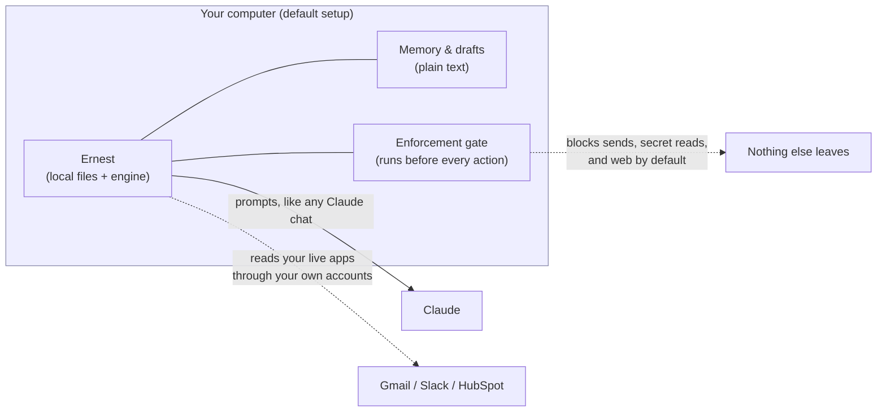
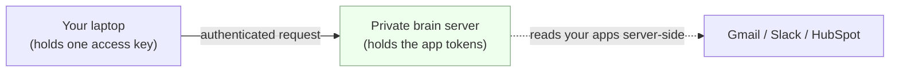

# Privacy — what stays on your machine

**Short version: in the default setup, everything stays on your computer. There is no Ernest server, nothing is sent anywhere, and no part of your data leaves the machine — and that isn't a promise in a doc, it's enforced by code that runs before every action.**

## What "local-first" means here

| Thing | Where it lives (default) | Leaves your machine? |
|---|---|---|
| Your memory (company, contacts, preferences, notes) | On your computer, as plain text files (`memory/*.md`) | **No** |
| Reminder cards, drafts, briefs | On your computer | **No** |
| Email / Slack / CRM you connect | Read live through your own accounts | Only between you and that app — the same as using the app yourself |
| The AI model | Claude, via your existing Claude app | Your prompts go to Claude, exactly like any Claude chat |

There is no "Ernest cloud." In the default setup Ernest is a local assistant: a folder of files and a small program on your machine.



## The guarantees, and how they're enforced

A small program runs automatically **before any tool Ernest tries to use** (`hooks/pre_tool_use.py`, which calls the decision logic in `ernest/gate.py`). It is **fail-closed**: if that check ever errors out, the action is denied, not allowed. Every decision is written to a local log you can read (`logs/enforcement-audit.log`).

- **No silent sending.** Ernest can never send an email, post to Slack, change your CRM, book a meeting, or pay anyone without you approving that exact action. Anything that *creates a draft* is allowed; anything that *transmits* is blocked.
- **No secret reading.** Ernest is blocked from reading credential files — `.env`, anything named like a token/secret/credential, SSH and AWS keys, `.pem`/`.key` files, and its own `.mcp.json` config — both as files and via the terminal.
- **No quiet phone-home.** In local mode, web access (web search and web fetch) is **off by default**, so nothing can be slipped out through a web request. You can switch it on per task — see below.
- **No back doors via the terminal.** Shell commands that reach the network (`curl`, `wget`, `ssh`, `scp`, …), pipe to a shell, or hit a connector's API directly are blocked, so the rules above can't be sidestepped with a one-liner.
- **Your data isn't mirrored.** If you ever add a server (optional, below), your app passwords/tokens live only there — never copied to your laptop, and vice versa.

**The rules can't quietly weaken themselves.** The gate file, the hooks, the settings, and the audit log are write-protected from Ernest itself (`scope.protect` in `ernest.yaml`), and the auto-updater refuses to ship a new version unless the gate's built-in self-test still passes (`scripts/self-update.sh` runs `python3 -m ernest.gate --selftest`). A change that opened a hole would never be applied.

### Turning web on for one task

Web stays off in local mode unless you opt in. To allow it for a single research task, set one environment variable:

```bash
ERNEST_ALLOW_WEB=1 ernest start
```

Leave it unset (the default) and web search/fetch stay blocked.

## If you ever want 24/7 (optional)

A laptop can't watch your inbox while it's asleep. If you want overnight coverage, you can add a private server (the "brain"). It is **opt-in and separate** — the default install never uses it:

- You choose it explicitly at setup (`./install.sh --mode vps`). Out of the box, mode is `local`.
- Then your connector tokens live on that server, isolated. Your laptop holds only a **single access key** (a bearer token to your own brain) — not your Gmail/Slack/CRM passwords.
- You can detach anytime and go fully local again, with no data loss.

For an NDA-sensitive setup, the recommendation is simple: **stay local.** The only thing you give up is overnight watching, which you can run on demand instead.



## Backups

Your memory is plain text (`memory/*.md`) — nothing locked in a proprietary format. You can open it, read it, diff it, and restore an earlier version using whatever you already use for files: your normal Time Machine / OS backup, or `git` if you keep the folder in a repo (memory files are tracked; logs, the local vault, and secrets are deliberately git-ignored). Backups never send your data anywhere unless you've chosen the optional server above.

## In one line

Default Ernest reads through your own accounts, drafts locally, and is stopped — by code that runs before every action and can't disarm itself — from sending, reading secrets, or reaching the web on its own.
