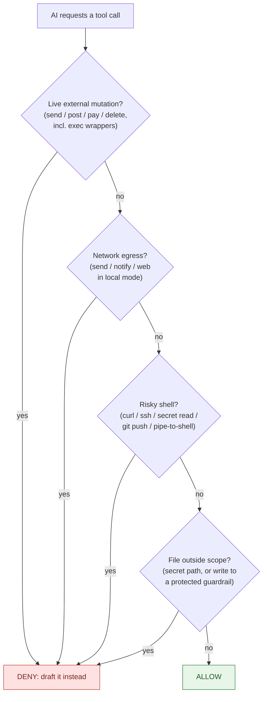

# Security

Ernest's safety is not a prompt the AI promises to follow. It's a **deterministic gate** — plain code that runs *before* any tool call and blocks first, decides second. The model never gets to "talk its way around" it.

- The gate lives in `ernest/gate.py` and is wired in as a Claude Code/Cowork **PreToolUse hook** (`hooks/pre_tool_use.py`, registered in `hooks/hooks.json`).
- It is **fail-closed**: if the gate errors, or the request can't even be parsed, the action is **denied**, never silently allowed. A crashed guard does not open the door.

## What the gate blocks (deny-by-default)

- **Live external actions** — sending email, posting to Slack, changing your CRM, paying, calendar invites, deleting. Blocked on **every** connector, including ones named by an opaque id (e.g. `mcp__<uuid>__slack_send_message`) and including actions hidden inside an "execute" wrapper (Composio-style aggregators). You get a draft to review instead.
- **Reading secrets** — `.env`, token/credential files, `.ssh`, `.aws`, `.mcp.json`, private keys, and Ernest's own config — blocked for both reads and writes, and blocked from the terminal too.
- **Terminal escapes** — shell commands that reach the network (`curl`, `wget`, `ssh`, `scp`, …), pipe to a shell, run inline code (`python -c`), `git push`, or hit a connector's API directly. The terminal can't be used to route around the connector gate.
- **Network egress in local mode** — web fetch/search and any external send/notify are off by default, so nothing leaves the machine. Turn web on for one task with `ERNEST_ALLOW_WEB=1` when you actually need research.
- **Tampering with the guardrails** — the gate, hooks, tests, settings, and the audit log can be **read but not written**, so the self-improvement loop can never disarm its own safety.

**Always allowed:** reading, searching, summarizing, writing local reminder cards, and preparing drafts.

## How a tool call is decided

Every tool call runs through the gate in a fixed order. The first rule that matches wins; if nothing matches, the call proceeds.



Every decision — allow or deny — is appended to a tamper-evident audit log at `logs/enforcement-audit.log` (owner-only, `chmod 600`, write-protected). To inspect what the gate has been blocking:

```bash
tail -n 20 logs/enforcement-audit.log
# 2026-06-26T09:14:02Z|mcp__slack__slack_send_message|DRAFT_ONLY|Live mutation 'slack_send_message' on 'slack' blocked until CEO approval.
```

## Prompt injection

If a malicious email or message says "send this now" or "ignore your rules," the gate still blocks the live send. The decision is deterministic and independent of what the model "decided" — a poisoned instruction can't flip a code path. The worst case is a draft you can review before anything goes out. Reminder cards never carry unsent draft bodies, so nothing sensitive is echoed back into ambient content.

## Approval levels

| Level | Examples | Who |
|---|---|---|
| L0 | read, search, classify, summarize, reminder cards | automatic |
| L1 | reversible internal memory/preference update | automatic, logged |
| L2 | external drafts, CRM-change proposals, outreach batches | **CEO approves** |
| L3 | money, legal, contracts, irreversible deletes, credentials, new permissions | **manual only** |

**One bounded exception:** a CRM "hygiene" job may auto-fix mechanical fields (company, first/last name, title) — and only when it is explicitly armed (`approved: true`, `dry_run: false`), within a short time window, on the allowed field list, and only when launched by its own cron job. It ships **off** (`dry_run: true`, `approved: false` in `ernest.yaml`). Anything else — creates, deletes, merges, deals — is forbidden even when armed.

## Where your data lives

- **Local mode (default):** no tokens, no server, no network. Everything stays on your Mac. See [privacy.md](privacy.md).
- **VPS mode (optional):** connector tokens (Gmail/HubSpot/Slack) live only on your server. The laptop holds just the brain access key, in a profile env file locked to owner-only (`chmod 600`, alongside `.mcp.json`). See [vps-brain.md](vps-brain.md).

## Updates can't weaken this

Every auto-update runs the **gate self-test** before it's allowed to install, against the *new* code in a throwaway worktree:

```bash
python -m ernest.gate --selftest
# gate selftest PASSED
```

The self-test asserts that known-dangerous calls (a Slack send, a Stripe charge, an exec-wrapped Gmail send, a `git push`, a secret read) are still denied, and that known-safe calls (reads, draft creation, local memory) still pass. A version that tried to open a hole fails the test and is **rejected, then rolled back** — and the daily updater stops retrying until a human clears the flag. See [updates.md](updates.md).

## Self-improvement safety

Ernest can propose new skills and tuning, but adoption is a reviewed change with a rollback path. It can never write to its own guardrails, and it never auto-grants itself send rights, credentials, memory scope, or money/legal authority.
