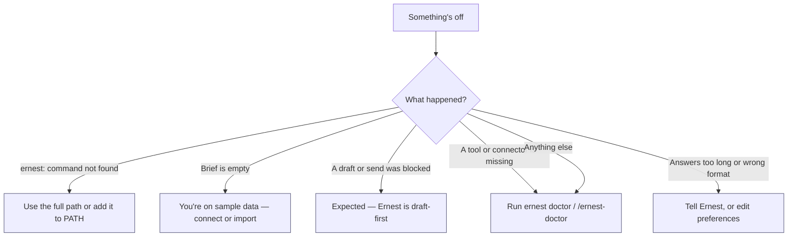

# Troubleshooting

Something not working? In almost every case the fastest fix is one command:

```bash
ernest doctor
```

It prints your mode, profile path, active connectors, and a `diagnostics:` block. Each issue comes with its own `fix:` line. If a fix needs research or installs, run `/ernest-doctor` inside Claude — Ernest will diagnose, look up the right tool, apply safe in-workspace fixes, and ask before anything that touches credentials or sends.

Use the table below to jump straight to your symptom.



---

## The install finished but I never saw a brief

The installer runs your first brief automatically and prints:

```
Here is what needs you right now:
```

If you didn't see it, re-run the health check and start manually:

```bash
bash install.sh --health-only   # confirms the package is complete
ernest start                    # watch + brief, the daily command
```

`--health-only` exits as soon as it verifies every required file is present. If it reports a missing file, your copy of the package is incomplete — re-download or re-clone, then run `./install.sh` again.

---

## `ernest: command not found`

The launcher always lives here:

```bash
~/.ernest-cc/bin/ernest start
```

To type just `ernest` from anywhere, add its folder to your PATH:

```bash
echo 'export PATH="$HOME/.ernest-cc/bin:$PATH"' >> ~/.zshrc
source ~/.zshrc
```

When you install to the default location (`~/.ernest-cc`), the installer also tries to link `ernest` into a directory already on your PATH (`~/.local/bin`, `/usr/local/bin`, or `/opt/homebrew/bin`). If that succeeded, `ernest start` already works — open a fresh terminal and try it.

---

## Empty brief / "nothing needs you"

Two harmless causes:

1. **Your data really is clean** — nothing has slipped.
2. **Ernest is still reading the bundled sample files**, not your live mail. `ernest doctor` shows `onboarded: no — running on SAMPLE data` when this is the case.

To make it yours, do either:

- **Connect live tools** (recommended): run `/ernest-setup` in Claude, or see [connectors.md](connectors.md) to wire up Gmail, HubSpot, Slack, and the rest as native MCP connectors.
- **Drop in exports**: place files under `data/mail/`, `data/hubspot/`, `data/slack/`, etc. Ernest reads exports the moment they appear.

Then try a real prompt from [examples.md](examples.md), e.g. *"What follow-ups did I drop this week?"*

> One quiet section can hide a deeper problem. If `ernest start` warns `Watch reminders are OFF`, "nothing needs you" may be wrong — run `ernest doctor` and let it repair your standing concerns.

---

## Health check fails

Run from the repo root:

```bash
bash install.sh --health-only
```

A failure means a required file is missing — your package is incomplete. Re-clone or re-download and re-run `./install.sh`. (This check never touches your memory or data; it only verifies the shipped code is all there.)

---

## A draft or send was blocked

This is by design, not a bug. Ernest is **draft-first**: it will never send an email, post to Slack, change a CRM stage, or modify any external system without your explicit approval of the exact action. A block means Ernest tried to do one of those and stopped.

Ask for a **reminder** or a **draft** instead — e.g. *"draft these"* — and review before you approve a send. See [security.md](security.md) for the full approval model (L0–L3).

---

## A tool or connector is missing — let Ernest fix it

Ernest is built to repair and extend itself. Start with:

```bash
ernest doctor
```

Every problem it finds comes with a `fix:` line. For an automatic pass — including researching the right MCP server on the web — run this inside Claude:

```text
/ernest-doctor
```

Ernest will diagnose, find the right tool, apply safe fixes inside your workspace, and propose anything that needs your sign-off (connectors, credentials, installs). It re-runs `ernest doctor` to verify, and can make a recurring fix permanent as a skill or automation.

---

## Connect to live tools instead of sample data

By default Ernest runs **local-only** and reads files under `data/`. To go live, connect native MCP connectors (Gmail, HubSpot, Slack, Calendar, Notion, Sheets) — run `/ernest-setup` in Claude or follow [connectors.md](connectors.md). No VPS is required for this.

**VPS brain mode** is the separate option where a hosted Ernest brain holds memory and heavy connectors. It needs two values:

```bash
ERNEST_BRAIN_URL=https://... ERNEST_BRAIN_TOKEN=... ./install.sh --mode vps
```

Don't have a brain yet? Stay local — just run `./install.sh` (the default). See [vps-brain.md](vps-brain.md).

---

## Updating Ernest (without losing your memory)

Use the built-in updater — it validates the new version before touching your install and **rolls back automatically** if anything fails:

```bash
ernest update           # one-tap: check, validate, apply, verify (auto-rollback on failure)
ernest update check     # just look for an update; nothing is applied
ernest update status    # current version, pending update, rollback state
```

When a daily check finds a good update, Ernest leaves a card in your watch folder:

```
Update ready — reply apply update to install. Auto-rollback if anything fails.
```

Replying **apply update** in Claude does the same thing as `ernest update`. Either way:

- Your **memory, custom skills, data exports, and config are never touched** — only the core code is refreshed.
- A version that fails its self-test is never installed.
- If a promotion fails mid-way, Ernest restores the previous version and pauses auto-updates until you've had a look.

See [updates.md](updates.md) for the full flow. (Maintainers working from a git checkout can still update by hand with `git pull --ff-only && ./install.sh --refresh`, but `ernest update` is the safe path for everyone else.)

---

## Change the ICP, grading, or talent pool

These are **living config**, not hardcoded. You can edit the rubrics directly:

```bash
data/grading/b2b-rubric.json       # B2B lead criteria, company lists, tiers
data/grading/talent-rubric.json    # talent pool, Tier-1 countries, signals
```

…or just tell Ernest in plain language: *"change our talent focus to fintech in Tier-1 EU."* Either way, re-tier your pipeline with:

```bash
ernest grade            # both B2B and talent
ernest grade --b2b      # leads only
ernest grade --talent   # talent only
```

---

## Answers are too long, messy, or not to your taste

Ernest answers in one house format — a short **Bottom line**, a few action bullets, then a **Read more →** link — driven by the Claude Code output style (`.claude/output-styles/ernest.md`) and `CLAUDE.md`. To adjust it:

- **Just say so.** *"too long, 4 bullets"*, *"prefer PDF"*, *"hide trash tier"*, *"always show $"*. Ernest updates `memory/preferences.md` and honors it from then on.
- **Reset a drifting reply** with *"Use the house format."*
- **Confirm the style is active:** in Claude run `/output-style` and pick `ernest`. It's auto-selected from `settings.json` (`outputStyle: ernest`); a new session or `/clear` applies it.
- **See or edit current settings:** `ernest prefs` shows the live values; `memory/preferences.md` holds the narrative and the keys.

For a shareable, identical-every-time view, render the daily digest:

```bash
ernest render --open    # build the HTML digest and open it in a browser
ernest render --pdf     # also export a PDF (falls back to "Print → Save as PDF")
```

The digest is generated deterministically at `00-Daily/digest--<date>.html` in your vault. To stop the auto-digest that runs on `ernest start`, set `auto_render: off` in `memory/preferences.md`.

---

## Cowork behaves differently from Claude Code

Use Claude Code as the bootstrap surface — it's the most predictable place to install and verify. The plugin is the same in both; once it works in Claude Code, confirm your connectors carry over on the Cowork build.
