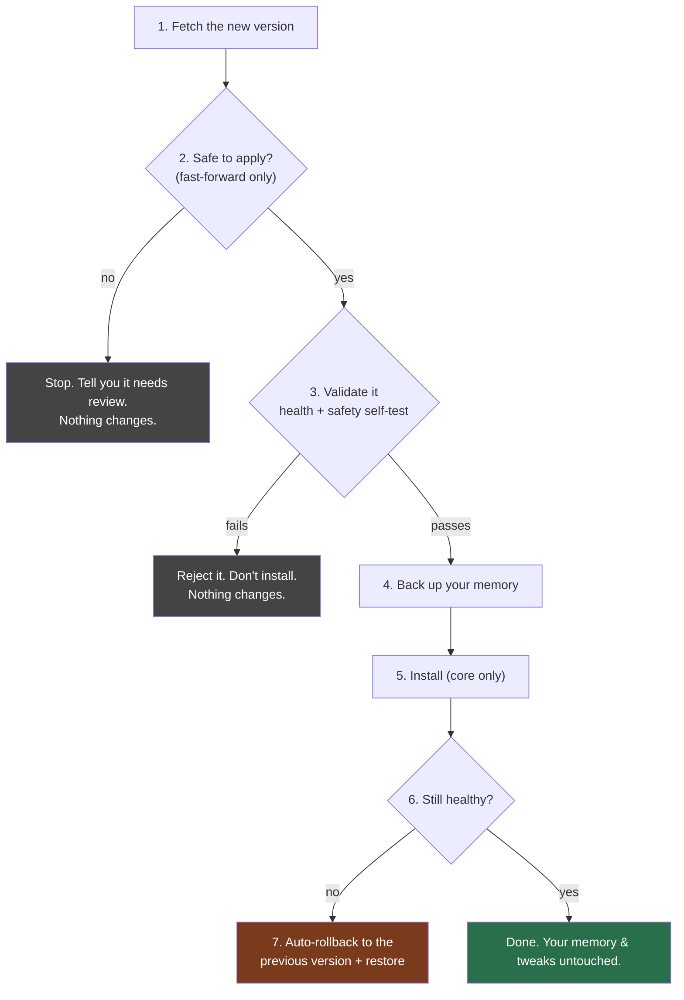

# How updates work

You never have to update Ernest by hand, and an update can never lose your memory or
your customizations.

## What you'll see

When a new version is ready, Ernest checks it, makes sure it's safe, and then shows
you a one-line card:

> Update ready — reply **apply update** to install. Auto-rollback if anything fails.

You reply **apply update** (or run `ernest update`). That's it.

## What happens behind that one tap

The important parts in plain words:

- **It validates first.** A broken or tampered update fails the safety self-test and
  is never installed. (A version that tried to weaken Ernest's safety gate would be
  rejected automatically.)
- **It only ever replaces Ernest's own code.** Your memory, your preferences, and any
  use-case you added live in separate folders the update never touches.
- **It backs up before applying**, and **auto-rolls-back** if anything looks wrong —
  then it won't keep retrying a bad update; it waits for a look.
- **You're never mid-broken.** If a step fails, you're left on the version that was
  already working.

## Turning it on

During setup, say yes to the morning check, or run `ernest schedule`. Ernest then
checks for updates each morning and shows the one-tap card when there's something new.
You can always run a check yourself: `ernest update check`.

## For the person who maintains Ernest (you)

Updates are published to a git channel. A test/soak surface tracks the newest commit;
the CEO's machine tracks a "stable" commit that's only promoted after the new one runs
clean. Pin by commit, never a moving branch. Full design: `ERNEST-UNIFIED-ARCHITECTURE.md` §9.
