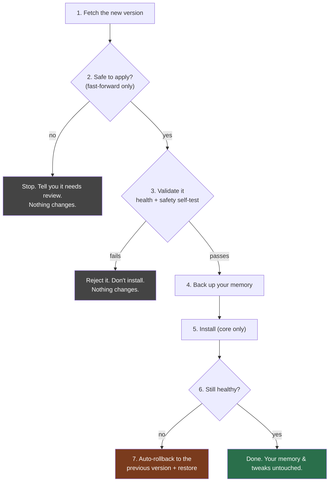

# How updates work

You never have to update Ernest by hand, and an update can never lose your memory or
your customizations.

## What you'll see

Nothing, usually — that's the point. Every morning at 7:30 Ernest fetches the
latest version, validates it, installs it, and re-verifies itself. When something
actually happened, a one-line card tells you after the fact:

> Update applied: now on `abc1234`. Your memory and custom skills are untouched.

If an update fails validation it is never installed; if it fails after install it
is rolled back automatically — and either way you get a card saying so.

Prefer to approve updates yourself? Switch the scheduled job to staged mode
(`ernest update check`): Ernest then only stages a card —

> Update ready — reply **apply update** to install. Auto-rollback if anything fails.

— and you promote it with `ernest update`.

## What happens on every update

```mermaid
flowchart TB
    fetch["1. Fetch the new version"] --> ff{"2. Safe to apply?<br/>(fast-forward only)"}
    ff -- no --> stop["Stop. Tell you it needs review.<br/>Nothing changes."]
    ff -- yes --> val{"3. Validate it<br/>health + safety self-test"}
    val -- fails --> stop2["Reject it. Don't install.<br/>Nothing changes."]
    val -- passes --> snap["4. Back up your memory"]
    snap --> apply["5. Install (core only)"]
    apply --> verify{"6. Still healthy?"}
    verify -- no --> rb["7. Auto-rollback to the<br/>previous version + restore"]
    verify -- yes --> done["Done. Your memory & tweaks untouched."]
    style done fill:#2a6f4b,color:#fff
    style rb fill:#7a3b1d,color:#fff
    style stop fill:#444,color:#fff
    style stop2 fill:#444,color:#fff
```

The important parts in plain words:

- **It validates first.** A broken or tampered update fails the safety self-test and
  is never installed. (A version that tried to weaken Ernest's safety gate would be
  rejected automatically.)
- **It only ever replaces Ernest's own code.** Your memory, your preferences, and any
  use-case you added live in separate folders the update never touches.
- **It backs up before applying**, and **auto-rolls-back** if anything looks wrong —
  then it won't keep retrying a bad update; it waits for a look.
- **You're never mid-broken.** If a step fails, you're left on the version that was
  already working.

## Turning it on

Run `ernest schedule` once. That installs the morning brief (8:00) and the daily
validated auto-update (7:30). Remove anytime with `ernest schedule --remove`.
You can always run one yourself: `ernest update` (apply now) or
`ernest update check` (stage only) / `ernest update status`.

## For the person who maintains Ernest (you)

Updates are published by pushing to the repo's `main` branch, then mirroring it
to `stable` for older installs (`git push origin main:stable`) — that's the whole
release step. New installs track `main`; pre-1.2 installs were configured for
`stable` (override either with `ERNEST_UPDATE_CHANNEL` in the profile `env`, e.g.
a soak/canary branch that takes changes first). If a configured channel branch
disappears from origin, the updater falls back to `main` on its own rather than
stranding the install. The updater is `scripts/self-update.sh`: fast-forward-only, a
commit that fails the health gauntlet or gate self-test is never applied, and a
failed promotion auto-rolls-back and sets a loop-stop flag
(`update-rolledback.flag`) so a bad version is never retried unattended.
