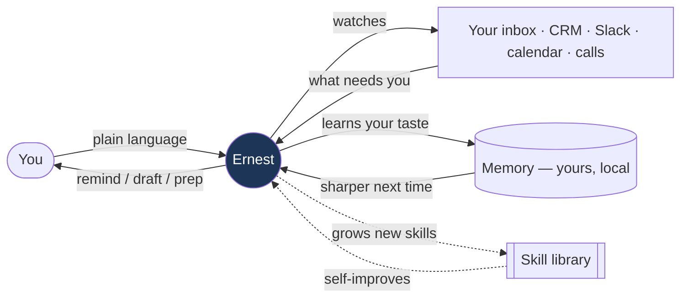
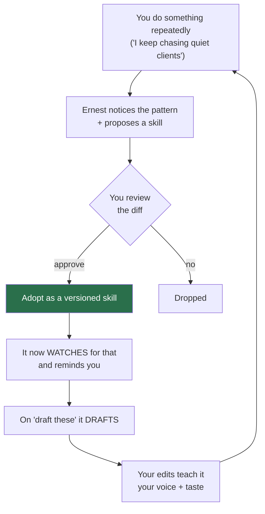
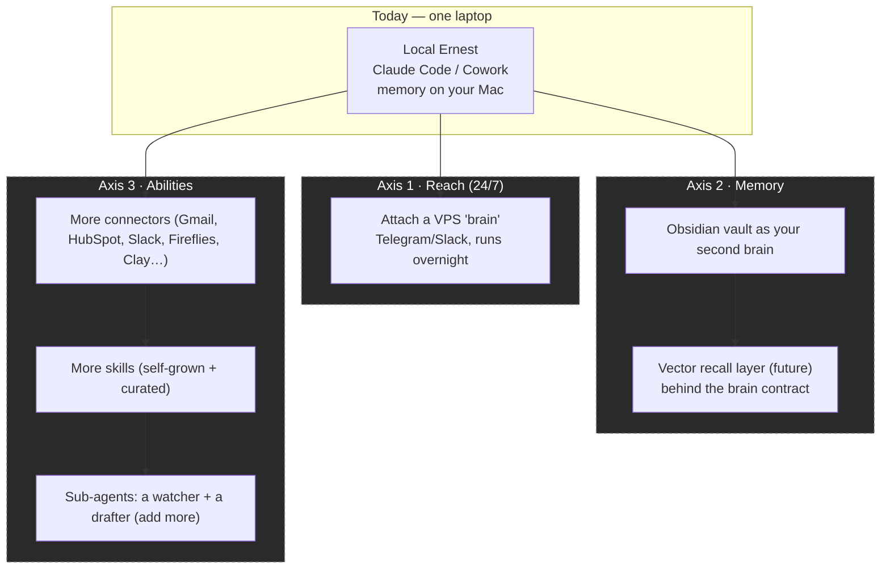
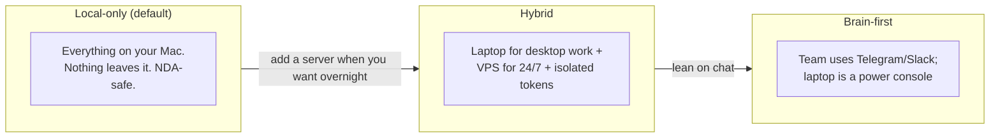

# What Ernest can become

Ernest isn't a fixed app with ten buttons. It's an operating layer for how you run
the company — it watches what's happening, tells you what needs you, drafts on
request, learns your taste, and **grows new abilities over time**. This page is the
horizon: what it does today, how it gets better, and how far you can take it.

---

## 1. The shape of the idea

One assistant. You talk to it like a chief of staff. It never sends anything
without you. Everything it knows about you stays on your machine by default.

---

## 2. What it can do today (the gallery)

Think in outcomes, not commands. A few that already work — and the kind of thing
to *try*:

| Area | Ask it… | What you get |
|---|---|---|
| **Triage** | "What actually needs me today?" | A ranked brief: open loops, slipping threads, VIPs gone quiet, stalled deals |
| **Follow-ups** | "Who did I drop? Draft the top 3." | Recovery drafts in your voice, for your review |
| **Inbound B2B** | "Grade this week's leads, ignore trash, draft Tier-1 replies." | Tier-1/2/trash, ranked by match strength, with who to loop in |
| **Hiring** | "Score this sourcing list, shortlist the top 5, draft outreach." | Tier-1/2/3 candidates ranked by fit, draft messages |
| **CRM hygiene** | "Preview the messy HubSpot records and fix the obvious ones." | A reviewable cleanup batch (auto-applies only the safe, mechanical fixes) |
| **Calls** | "I have Acme at 3 — make me call-ready." | A one-pager: history, open questions, 3 things to land |
| **Support** | "Anything on fire in support?" | Triaged threads by severity, with suggested owners |
| **Loop-ins** | "Who should be on this thread that isn't?" | Missing-collaborator nudges |

Full prompt catalog, simple → complex: [examples.md](examples.md).

The point isn't the list — it's that you can **invent the next one in a sentence**,
and if it's worth keeping, Ernest can turn it into a permanent skill (§4).

---

## 3. How an automation is born (the lifecycle)

This is the loop that makes Ernest get better the more you use it:

Nothing self-modifies behind your back: every new skill is a reviewable change
with a rollback, and Ernest can never grant itself the right to send, spend, or
touch credentials. It extends what it *does*; it can't expand its *authority*.

---

## 4. How far it scales (the big picture)

Start as a single local assistant. Grow it on three independent axes — **reach**,
**memory**, and **abilities** — as far as you want:

- **Reach** — the laptop can't watch your inbox while it's asleep. Attach a VPS
  "brain" and Ernest answers on Telegram/Slack 24/7, with connector tokens isolated
  on the server (the laptop holds only a key). Local and VPS stay in sync and cover
  each other. Detach anytime, fully local again.
- **Memory** — your memory is already plain Markdown laid out as an **Obsidian
  vault** (`~/ErnestVault/Ernest/…`). Point Obsidian at it and you have one
  navigable second brain for everything Ernest learns. Later, if you want recall
  over thousands of notes/threads, you could plug a **vector-search layer** behind
  the same brain contract (`brain/ernest-brain.contract.json`) without changing a
  single skill. *(That layer is a future add-on, not shipped today.)*
- **Abilities** — connectors are a swappable layer; skills are the unit of
  automation and Ernest grows its own; and heavy jobs can fan out to focused
  sub-agents (today: a **watcher** and a **drafter** — add your own).

---

## 5. Deployment shapes (pick one, change later)

None of these are one-way doors. The same Ernest runs in all three; you change
posture with one setting. See [privacy.md](privacy.md) for what stays where.

---

## 6. Things to try (spark)

When you're ready to push it:

- **"Run my Monday in 10 minutes"** — triage everything, rank it, draft the top
  five replies, and tell me who to loop in.
- **"Be my deal desk"** — watch every active deal, flag the ones going cold, and
  prep the next touch for each.
- **"Turn my call notes into action"** — after each Fireflies recording, extract
  commitments and draft the follow-ups.
- **"Grow a new muscle"** — "Every Friday, summarize what slipped this week and
  propose one automation to prevent it." If it's useful, keep it as a skill.
- **"Give me a second brain"** — open the vault in Obsidian; ask Ernest to file
  what it learns as linked notes you can browse.
- **"Go wide on talent"** — "Find 40 senior gen-AI engineers at top labs, rank by
  fit, shortlist 8, draft outreach." (Breadth first, then it ranks — see
  [add-automation.md](add-automation.md) to make it recurring.)

The rule of thumb: **say the outcome you want.** If Ernest can do it with what's
connected, it will (draft-first). If it can't yet, it'll tell you what's missing —
and often propose the skill that would close the gap.

---

*Want to add one of these as a permanent, scheduled automation? See
[add-automation.md](add-automation.md). New here? Start with
[how-it-works.md](how-it-works.md).*
